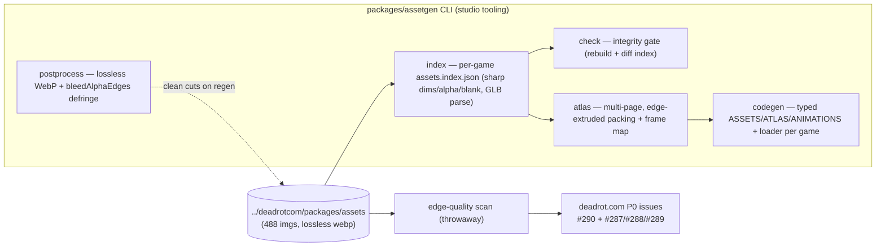
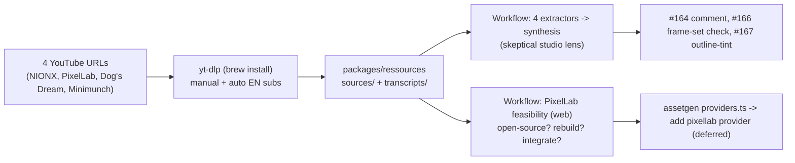

# 2026-06-09

## Session 1 — Repo audit → board reconcile → assetgen toolbox build-out (index/check/atlas/codegen) + asset-bleeding fix

Started as "check PRs/branches/worktrees/boards — are we up to date with develop, can we build?"
and grew into a full toolbox build-out: shipped **7 PRs to `develop`** (all merged, CI green,
0 open), reconciled the board, and filed a P0 asset-regeneration catalog in `deadrot.com`.

### System flow

### Branch/flow facts (confirmed)
- Flow is **`develop` → `staging` → `master`** (promotion merge PRs). All in content parity.
- This repo (`shipshitgames`) = studio tooling. **Deadrot game assets live in `../deadrotcom`**
  (`apps/games/*`, `packages/assets`). **Warline migrated out** of shipshitgames to
  `deadrotcom/apps/games/warline` — #34 on board #4 was scope-checked → Done.
- assetgen default assets dir = `../deadrotcom/packages/assets` (via `defaultAssetsDir()`),
  game repo via `defaultRepo(game)`.

### What was done
- [x] Repo audit (Workflow, 3 agents): branches synced, CI green, **pruned 3 stale Codex worktrees**.
- [x] **Board #4 reconcile**: #34 Warline→Done (scope-checked), advanced 5 stale items (#37/#5/#8→Human Review, #38/#40→Done), **triaged 26 untracked issues** (#90–#115,#150) as Todo.
- [x] **#102 game-tester** (PR #155): generic Playwright QA harness; built + adversarial-review Workflow (7/7 findings fixed) + merged.
- [x] **react-doctor** (PR #156): added devDep + `lint:react` + `doctor.config.ts` (ignore Nextra `_meta`); **54 fixes (75→25)** across web/app/desktop/ui via per-file fan-out Workflow; **`@shipshitgames/ui` peer React `^18.3.1`→`^19`**.
- [x] **#101 `assetgen index`** (PR #157): per-game tagging, `--game`, sharp 2D + blank/sheet, deps-free GLB parser, `--check`.
- [x] **Asset QA scan + catalog**: scanned 488 imgs (sharp raw RGBA: fringe/clipped/no-cutout/lossy); filed **deadrot.com #290 + #287/#288/#289 (P0)**.
- [x] **#158 defringe**: postprocess → **lossless WebP default** + `bleedAlphaEdges` (RGB dilate into transparent margin; alpha untouched).
- [x] **#159 `assetgen check`**: asset-integrity gate (rebuild + diff every `assets.index*.json`).
- [x] **#92 `assetgen atlas`** (PR #160): deterministic multi-page shelf packer, edge-extruded gutters, frame map, `--check`.
- [x] **#22 `assetgen codegen`** (PR #161): typed `ASSETS`/`ATLAS`/`ANIMATIONS` + framework-agnostic `loadAssets()`, per game, `--check`.
- [x] All 7 PRs merged to `develop`; typecheck 8/8, 0 open PRs.

### Key decisions
- **Boundary routing**: asset-regen issues filed in **deadrot.com** (not shipshit.games #4) — shipshitgames owns tooling, deadrot owns shipped assets.
- **codegen spec (confirmed w/ Vincent)**: writes `../deadrotcom/apps/games/<game>/src/assets.generated.ts` by default (`--out` override); **framework-agnostic** data + thin DOM loader (no engine import).
- **Atlas must be multi-page**: one sheet of a game's sprites blows past WebP's 16383px cap → page at 4096².
- **Bleeding is source-baked** (assets already lossless VP8L) → fix = regenerate through the new defringe pipeline, not re-encode. Lossy `quality:90` in old postprocess was the systemic culprit.
- **Worktree isolation pattern** for the react-doctor cleanup: one agent per file (disjoint), central verify (build+typecheck+rescan) + diff review; defer risky refactors (prefer-useReducer, no-multi-comp/shadcn) with documented reasons.

### Files changed (new this session, all under `packages/assetgen/src/` unless noted)
`asset-index.ts(+test)`, `commands/index-assets.ts`, `commands/check.ts`, `atlas.ts(+test)`,
`commands/atlas.ts`, `codegen.ts(+test)`, `commands/codegen.ts`, `postprocess.ts(+test)`;
`cli.ts` (wired index/check/atlas/codegen), `README.md`. New package `packages/game-tester/**`.
react cleanup touched `apps/{web,app,desktop}` + `packages/ui` (21 files). Root `package.json`
(+react-doctor, lint:react), `doctor.config.ts`.

### Mistakes and fixes
- **sharp `.extract().stats()` reads the WHOLE image, not the crop** — hit TWICE (sprite-sheet blank-frame test in #101, atlas placement test in #92). Fix: materialize the crop to a buffer first (`.extract().png().toBuffer()` → `sharp(buf).stats()`). Also applies to in-runner cell sampling.
- **codegen id collisions**: stripping the extension collapsed `x.jpg`+`x.png` → dropped 4 of 373 assets. Fix: `buildIdMap` keeps the extension only for colliding ids.
- **Atlas WebP too large**: 369 sprites in one sheet > 16383px. Fix: multi-page packer.
- **#157 CI "failed"** (15m, no error lines) = transient infra timeout; `gh run rerun --failed` went green (later runs ~40s).
- **Workflow `args` not delivered** (`FILES.map is not a function`) — hardcode the list in the script instead of relying on `args`.
- **Adversarial review Workflow hit the session rate limit** first run (reviewers died); re-ran after reset → 7 real findings, all fixed.
- **Local sharp/libvips dlopen error** when running a `/tmp` script — global-cache sharp is broken; run scripts from inside `packages/assetgen` so it resolves the package's sharp.

### Next steps
- **Run regeneration** on the cataloged assets (deadrot.com #287/#288/#289) through the new defringe pipeline — needs codex credits (Vincent currently has none).
- **Wire `codegen`/`atlas` outputs into the games** (deadrotcom task): import `assets.generated.ts` + ship atlas pages per game.
- **`promote`** is the only remaining `assetgen` stub (asset staging→ship lifecycle).
- **Flip on CI gates**: `assetgen check` / `index --check` / `atlas --check` / `codegen --check`, and `lint:react` (`--blocking warning`) once deferred react-doctor items are triaged.
- **Deferred react-doctor items** (PR #156 left 25 as warnings): prefer-useReducer ×5, no-giant-component, no-multi-comp/only-export-components (shadcn — likely wontfix), font-link in apps/app (spans globals.css).

### Tracked follow-ups (GitHub, filed/updated this session)
Checked existing issues first to avoid dupes — most follow-ups already had issues.
- **deadrot.com #290** (+ #287/#288/#289) — asset edge-quality regen (P0). On deadrot board #10.
- **deadrot.com #293** — wire `codegen`/`atlas` outputs into each game (P1). On deadrot board #10.
- **shipshit.games #162** — enable `assetgen --check` gates + `lint:react` in CI. On board #4 (Todo).
- **shipshit.games #54** — `promote` (last assetgen stub) already existed; commented with context (not duplicated).
- **shipshit.games #51** (codegen loader) + **#53** (lossless webp) — commented as addressed by PRs #161 / #158.
- **Boundary rule applied:** tooling follow-ups → shipshit.games #4; game-asset/integration follow-ups → deadrot.com.
- Note: a `gh project item-list` parse blip (control char in an issue title) + a transient GitHub 502 occurred during board edits — both cosmetic; board state is correct.

---

## Session 2 — Engine branch already merged; ressources transcript capture + AI-gamedev research

Started as "should we commit/merge the engine branch?" (it was already merged — PR #163) and
turned into capturing 4 AI game-dev YouTube transcripts into `packages/ressources`, distilling
lessons from them, and a PixelLab build-vs-integrate research pass.

### System flow

### Branch/flow facts (confirmed)
- **PR #163** (engine camera+input extraction, release 0.2.0) was already **MERGED** to `develop`
  (merge `f5b2036`, 17:48). Nothing to commit/merge; fast-forwarded local `develop`.
- `packages/ressources` is pre-existing studio tooling (the `research -> ressources` rename), **not**
  a duplicate; no copy in `../deadrotcom`.

### What was done
- [x] **Captured 4 transcripts** via yt-dlp — NIONX 3408w (manual EN subs), Minimunch 3037w,
  Dog's Dream 1958w, PixelLab 418w. `validate` -> 18 sources / 7 transcripts, 0 errors.
- [x] **PR #165** (base develop): 4 sources + 4 transcripts + sidecars, the `transcript.ts`
  manual-subs fix, and README/header doc fix.
- [x] **Distillation Workflow** (4 extract + 1 synth): net signal = these clickbait/3D/ad videos mostly
  **validate our assetgen thesis**. Real findings -> #164 comment (directional ANIMATIONS metadata),
  **#166** (frame-set geometry contract in `check`), **#167** (outline-tint `postprocess`).
- [x] **PixelLab feasibility Workflow** (3 web agents + synth): **not open source** (models proprietary,
  cloud-only; only the JS SDK is MIT). Rebuild = research-grade, multi-quarter (the ML core). Integrate =
  days, because assetgen **already** has a pluggable `AssetProvider` (codex/openai/fal/replicate/suno/mock)
  in `src/providers.ts` -> add a `pixellab` provider. Recommendation **A1+B, defer C**. Paid API
  ($12/$24/$50 + per-op credits); the `codex` provider is the only "free" one (rides your subscription).

### Key decisions
- **Provenance**: stored raw transcripts as `public-captions` (storeRawTranscript true), with fetch
  source + word count per sidecar. Reversible.
- **Anti-dupe**: finding #1 -> commented on existing **#164** rather than filing a dupe.
- **yt-dlp install** was necessary, not optional — the dependency-free path is YouTube-broken.
- **transcript.ts**: request manual + auto subs (route around 429), not auto-only.

### Files changed
New (PR #165): `packages/ressources/sources/{nionx,pixellab,dogs-dream,minimunch}/source.json`,
`transcripts/<slug>/*.{transcript.md,resource.json}`. Fixed: `packages/ressources/src/transcript.ts`
(manual subs + header), `README.md`. New repo memory: `.agents/memory/ressources-transcripts.md`.

### Mistakes and fixes
- **Watch-page caption scrape returns an empty body** (HTTP 200, len 0) — YouTube now needs a player
  `pot` token. Fix: install yt-dlp; documented that the "zero native deps" path is effectively dead.
- **yt-dlp auto-subs 429'd NIONX** repeatedly; retrying the same endpoint didn't help. Fix: also request
  `--write-subs` (manual) — different endpoint, worked first try, higher quality. Baked into `transcript.ts`.

### Next steps
- **PR #165** review/merge to develop.
- **Backlog (unblocked, in-repo):** `promote` (#54, last assetgen stub); CI gates (#162).
- **From distillation:** #166 frame-set check, #167 outline-tint, #164 animation metadata.
- **PixelLab:** add a `pixellab` AssetProvider (days) if/when we want pixel-art gen; deferred per user.
- **Blocked:** asset regen (deadrot #287–289) needs codex credits. **deadrot #293:** wire codegen/atlas
  outputs into games.
