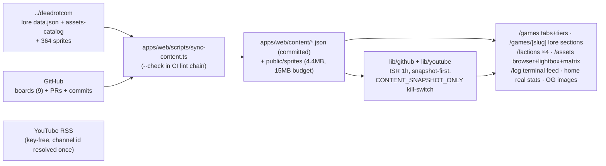

# 2026-06-10

## Session — shipshit.games website overhaul: lore-driven game pages, build-in-public feed, asset browser, palette + analytics

Scope set by Vincent: make the studio website more readable, intuitive, and gaming-oriented, and ship as many
features end-to-end as possible. Two PRs to `develop`: **#169** (content/data layer) and **#170** (the overhaul,
4 lanes built by parallel worktree agents). Closes board items **#24** (gallery cards), **#25** (per-game landing
pages), **#32** (funnel analytics).

### System flow

### Branch/flow facts (confirmed)
- Games/lore live in `../deadrotcom`; the website cannot read it on Vercel → sync tool snapshots content INTO
  this repo (same boundary pattern as assetgen). deadrotcom stays source of truth.
- The lore source is `deadrotcom/apps/web/lib/content/data.json` (games/factions/characters/bestiary/universe),
  NOT separate `lore/*.json` files — an exploration agent hallucinated those paths; verified before building.
- Lore has `zero-day` (concept, not in gallery) and no `warline` entry — joins tolerate both directions.
- Every game has a project board incl. `deadrot.com/scourge-survivors` (#1).

### What was done
- [x] **PR #169** (merged): `sync-content.ts` (+`--check` wired into root lint as `check:content`), committed
  snapshots (7 games lore, 3 factions, 16 characters, 11 creatures, 102-asset index with AI provenance +
  dependency-free webp dimension parser, 9 roadmap boards, 77 activity events), 4.4MB curated sprites,
  ISR fetchers (`lib/github.ts`, `lib/youtube.ts`), 12 bun unit tests, turbo env keys.
- [x] **PR #170** (4 lanes via parallel worktree Workflow agents, zero merge conflicts):
  - Lane A: gallery v2 (status tabs, tiered, accent glow, roster thumbs), game briefs v2 (features, roster,
    bestiary, sprite gallery, live roadmap counts, watch-the-build, JSON-LD), `/factions` ×4, dynamic OG images.
  - Lane B: `/log` terminal feed (day-grouped PRs+commits, snapshot notice), home with real stats/latest-shipped/
    games rail/CTA dedupe, youtube latest-uploads via RSS.
  - Lane C: `/assets` data-driven browser (game/kind/faction pills), native-dialog lightbox with provenance
    (gpt-image-2, date, scope, dims, palette-lock), cross-game variant matrix, real prompt→render→grade→ship.
  - Lane D: ⌘K cmdk palette, konami Scourge takeover, scanlines/sprite-pop/badge-pulse, nav restructure
    (+active states, ⌘K hint), sitemap/robots/Organization JSON-LD, Vercel Analytics + typed funnel events.
  - Integration: `web-e2e` CI job (Playwright vs production build, `CONTENT_SNAPSHOT_ONLY=1`), smoke routes
    `/log` `/factions` `/factions/the-pyre`, `demo_click` via `PlayBuildLink`.
- [x] **28/28 e2e** across 6 specs; full `bun run ci` green locally before each PR.
- [x] Board #4: #24/#25/#32 → Human Review (visual review on the Vercel preview is Vincent's).

### Key decisions
- **Snapshot-first ISR**: fetchers never hit the network without `GITHUB_TOKEN`; `CONTENT_SNAPSHOT_ONLY=1` forces
  snapshots in CI/e2e → zero-network tests. Live roadmap GraphQL additionally gated behind
  `GITHUB_TOKEN_HAS_PROJECT_SCOPE=1` (fine-grained PATs usually lack org Projects read).
- **File-ownership map for parallel agents**: only lane D may touch `layout.tsx`/`globals.css`/header/footer/
  `package.json`; shared needs (breadcrumbs, lib/seo, playwright env) pre-built on the base branch. Result: 0 conflicts.
- **No game embeds** (Vincent), link-outs stay; YouTube thumbs via plain `` (no next/image remotePatterns).
- `@types/bun` needs an explicit `"types"` array in apps/web tsconfig — auto-include can't follow the
  bun-types reference through bun's isolated-store symlinks.

### Mistakes and fixes
- **Exploration agent hallucinated data paths** (`packages/assets/lore/*.json`, 30+ characters, locations.json) —
  none existed. Fix: verify every claimed source file before building on it; the real dataset was elsewhere and smaller.
- **Workflow worktrees were cut from an older HEAD**, not the current branch — all 4 agents detected it and
  `git reset --hard feat/web-content-sync` before starting (branches had no commits, so safe).
- **Port 3000 contention**: parallel lanes' playwright webServers + an unrelated dev server raced
  `reuseExistingServer`; agents serialized themselves. For future parallel e2e: distinct ports per worktree.
- `gh api search/issues` needs `-f q=...` (GET form encoding); first attempt with a raw path 422'd.
- Background `until` watcher: `grep -qv pending` is NOT "no pending lines" — use `! grep -q pending`.

### Files changed (high level)
PR #169: `apps/web/scripts/sync-content.ts` + `scripts/sync/*` (+3 test files), `apps/web/lib/content/*`,
`lib/github.ts`, `lib/youtube.ts(+test)`, `content/*.json`, `public/sprites/**` (96 files), root+web `package.json`,
`turbo.json`, web `tsconfig.json`, `playwright.config.ts`, `lib/seo.ts`, `components/site/breadcrumbs.tsx`.
PR #170: `app/{games,factions,assets,log,youtube}/**`, `app/page.tsx`, `app/layout.tsx`, `app/globals.css`,
`app/{sitemap,robots}.ts`, `components/{games,assets,log,home,site}/**`, `lib/analytics.ts`, `app/pricing/*`,
6 e2e specs, `.github/workflows/ci.yml` (web-e2e job).

### Next steps
- **Vercel env**: set `GITHUB_TOKEN` (Contents/Metadata/PRs read) for the live activity feed; optionally a
  Projects-scoped token + `GITHUB_TOKEN_HAS_PROJECT_SCOPE=1` for live roadmaps. Site fully works without.
- **Refresh cadence**: run `bun run sync:content` per session (or wire a cron) to keep roadmap/activity snapshots fresh.
- Review #24/#25/#32 on the preview → Done. Promote develop → staging → master when satisfied.
- Candidates next: portrait regen in locked pixel style (#89), docs site (#30), pricing FAQ/annual, faction crest art.

## Session 2 — tooling: Context7 MCP + skill for live library docs

Environment-only session; no repo files changed. Goal: agents stop answering library/framework questions
from stale training data.

### What was done
- [x] Added **Context7 MCP server** at **user scope**, remote HTTP transport (`https://mcp.context7.com/mcp`)
  via `claude mcp add` → `~/.claude-genfeedai/.claude.json`. Health check: connected.
- [x] Installed official **`upstash/context7@context7-mcp` skill** globally via `npx skills add -g`:
  canonical at `~/.agents/skills/context7-mcp`, symlinked into `~/.claude/skills`, `~/.claude-genfeedai/skills`,
  plus Codex/Cursor/Copilot universal dirs (matches existing skills convention).

### Key decisions
- **Remote HTTP transport over local stdio** (`npx @upstash/context7-mcp`): always latest, no local process.
- **Only the `context7-mcp` skill** — siblings `find-docs`/`context7-cli` trigger on the same questions but
  route through the `ctx7` CLI; installing both would conflict with the MCP route.
- Keyless for now (rate-limited). If limits hit: free key at context7.com/dashboard, re-add with
  `--header "CONTEXT7_API_KEY: <key>"`.

### Notes
- MCP tools + skill load at session start — effective from the next session (this `/clear` completes that).
- Usage flow the skill enforces: `resolve-library-id` → `query-docs` whenever a library/framework is named.
