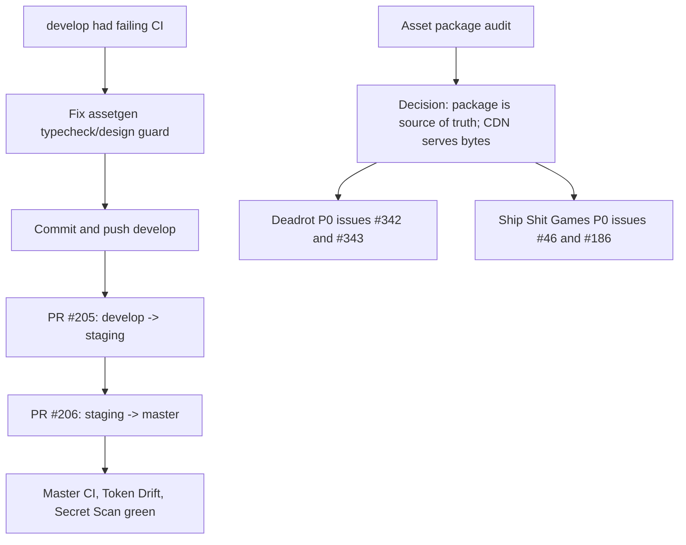

# 2026-06-12

## Session 1: develop -> staging -> master promotion, remote cleanup, and asset-origin P0s

### System Flow

### Affected Components

- `packages/assetgen`: typecheck repair for `clean-sprites` and `.claude` design-guard ignore.
- GitHub branches: remote cleanup and branch promotion through `develop`, `staging`, `master`.
- `apps/desktop`: confirmed it already reads the sibling Deadrot assets package locally.
- `apps/web`: confirmed it snapshots Deadrot package assets during `sync:content` rather than live-reading the package at runtime.
- `apps/app` / `apps/api`: confirmed Asset Lab images currently live in Postgres bytes and app/API proxy routes.
- GitHub project boards: `deadrot.com` and `shipshit.games`.

### What Was Done

- Fixed failing `origin/develop` CI:
  - `packages/assetgen/src/commands/clean-sprites.ts`
  - `packages/assetgen/src/design-guard.ts`
  - `packages/assetgen/src/design-guard.test.ts`
- Verified locally:
  - `bun run --cwd packages/assetgen typecheck`
  - `bun run --cwd packages/assetgen test`
  - `bun run check:design`
  - `bun run ci`
  - `git diff --check`
- Committed and pushed `develop`:
  - `7ce6cc9 fix(assetgen): type clean-sprites command for CI`
- Promoted:
  - PR #205 `develop -> staging`, merged at `cea097d`
  - PR #206 `staging -> master`, merged at `93fd210`
- Confirmed master branch checks green:
  - CI
  - Token Drift
  - Secret Scan
- Deleted merged/stale remote branches:
  - `chore/playwright-1.60`
  - `feat/11-partykit-transport`
  - `refactor/198-matrix-pipeline-dedup`
  - `refactor/route-groups-auth`
  - `codex/pr-order-resolved-20260612`
- Kept real WIP branch:
  - `origin/feat/4-suno-music-provider`
- Audited asset loading and confirmed `/Users/decod3rslabs/www/shipshitgames/deadrotcom/packages/assets` is the real shared package.
- Created/updated P0 GitHub issues:
  - `shipshitgames/deadrot.com#342` Publish `@shipshitgames/assets` to a CDN-backed asset origin.
  - `shipshitgames/deadrot.com#343` Generate canonical asset manifest with local package paths and CDN URLs.
  - `shipshitgames/shipshit.games#46` Consume shared asset manifest/CDN across studio apps.
  - `shipshitgames/shipshit.games#186` Move Asset Lab generated images to the shared asset origin.
- Added those issues to their org boards with `Status: Todo` and `Priority: P0`.

### Key Decisions

- `@shipshitgames/assets` in `../deadrotcom/packages/assets` remains the source of truth for manifests, local dev, and assetgen writes.
- Runtime/deployed media bytes should be served from a CDN/object-store origin, not primarily through an 887 MB npm package.
- Publishing the package can still make sense for metadata/types, but CDN/object storage should serve image/audio/model bytes.
- Ship Shit Games consumer work and Deadrot asset-package/origin work should be tracked separately but linked.

### Files Changed

Committed earlier in this session:

- `packages/assetgen/src/commands/clean-sprites.ts`
- `packages/assetgen/src/design-guard.ts`
- `packages/assetgen/src/design-guard.test.ts`

Session documentation:

- `.agents/SESSIONS/2026-06-12.md`

### Mistakes And Fixes

- Initial CI failed on strict TypeScript in `clean-sprites`; fixed with explicit option/result typing and guards.
- `check-design` tripped over nested `.claude` worktree files; fixed by ignoring `.claude` in the design guard.
- The GitHub connector could read issue data but could not create issues in `deadrot.com`; fell back to authenticated `gh` CLI.

### Current State

- Main repo branch: `develop`, clean except for pre-existing/unrelated untracked `.github/workflows/react-doctor.yml`.
- Local worktrees still present:
  - `/private/tmp/shipshitgames-pr-order` on `codex/pr-order-resolved-20260612`; remote branch was deleted.
  - `.claude/worktrees/wonderful-goldberg-1c5b2a` on `feat/4-suno-music-provider`; clean and not ahead of remote.
- Remaining remote branches after cleanup:
  - `develop`
  - `staging`
  - `master`
  - `feat/4-suno-music-provider`

### Next Steps

- Decide the concrete asset origin provider/domain for `deadrot.com#342`.
- Implement the generated canonical asset index for `deadrot.com#343`.
- Then wire consumers through `shipshit.games#46` and migrate Asset Lab media through `shipshit.games#186`.
- Optionally remove the local `/private/tmp/shipshitgames-pr-order` worktree if no longer needed.
