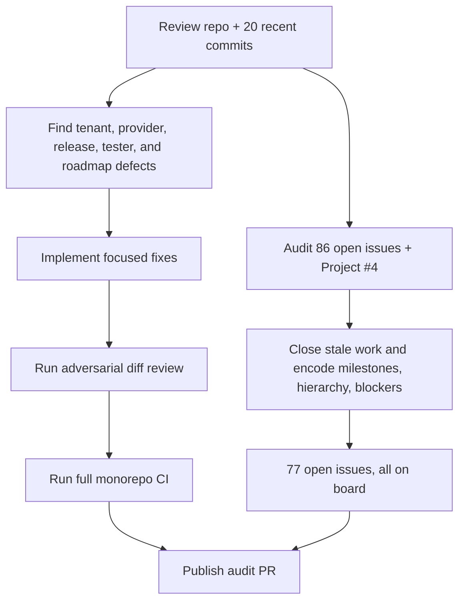

# 2026-07-09

## Session 1: full project, recent-commit, PR, and GitHub roadmap audit

### System Flow

### Affected Components

- `apps/api`: Asset Lab ownership, private delivery, media metadata, object
  compensation, slice concurrency and ZIP limits.
- `packages/assetgen`: fal reference-image request schema and provider
  capability enforcement.
- `apps/desktop`: canonical shared IPC channel/API contract.
- `packages/tester`: fail-closed JSON/Markdown report persistence.
- `apps/web`: canonical live/legacy GitHub roadmap status handling.
- release/CI: package-only atomic publication and honest Deadrot asset checks.
- docs/memory: repository map, Shipshitcode direction and the durable audit.
- GitHub Project #4: issue closure, re-scoping, milestones, types, priorities,
  hierarchy and dependencies.

### What Was Done

- Confirmed there were zero open PRs in `shipshitgames/shipshit.games` at audit
  start; all required checks on the latest `master` were green.
- Reviewed all 20 commits from 2026-06-25 through 2026-07-09.
- Fixed cross-tenant Asset Lab reads and direct object URL exposure; added 15
  focused API/storage tests.
- Fixed fal image-to-image endpoint/schema and unsupported reference handling.
- Centralized 28 desktop invoke channels and event channels under one shared
  typed contract; desktop unit suite has 115 passing tests.
- Made tester report persistence part of the verdict and CLI exit code; tester
  suite has 41 passing tests including browser integration.
- Replaced the release/deploy orchestrator with a package-only publisher that
  preflights every pending package before any irreversible publish.
- Replaced the zero-target assetgen CI step with the real Deadrot native index
  integrity check and tracked explicit target-aware gates in #319.
- Added web/docs root typechecking and fixed roadmap status drift.
- Wrote `docs/audits/2026-07-09-project-roadmap-audit.md`.
- Reconciled GitHub:
  - closed 19 completed, superseded or wrong-repo issues;
  - added #291–#300 and #310–#319 to Project #4;
  - created Launch M0/M1/M2, Shipshitcode M5 and Rotforge M0 milestones;
  - assigned missing types/priorities;
  - normalized status so Human Review contains only external actions;
  - added native sub-issue trees and Shipshitcode blocker links.
- Verified the final working tree with local secret scan, focused suites,
  `git diff --check`, and two successful full `bun run ci` passes.
- Published ready-for-review PR #320 with eight logical commits; its body closes
  #197 and audit issues #310–#313 after merge.

### Key Decisions

- Asset Lab records are private per Clerk owner; stored object URLs are an
  implementation detail, never the authorization boundary.
- Provider reference support is an explicit capability. Unsupported adapters
  fail instead of ignoring identity/style inputs.
- Package publication, downstream dependency updates and application deployment
  are separate reviewed operations.
- Shipshitcode remains a local-first cockpit with a hosted control plane; the
  hosted app is not embedded wholesale into the desktop.
- The next critical path is #314/#315 security, #316 packaged runtime, #49
  canonical manifests, then #302–#308 in dependency order.
- Human Review is reserved for work that genuinely needs a person, paid spend,
  account configuration, 2FA or external publication.

### Files Changed

See the complete categorized inventory in
`docs/audits/2026-07-09-project-roadmap-audit.md`. The largest code areas are:

- `apps/api/lib/assets.ts` and Asset Lab routes/tests
- `packages/assetgen/src/fal.ts` and provider catalog/tests
- `apps/desktop/src/shared/ipc.ts` plus main/preload/renderer consumers
- `packages/tester/src/report-files.ts` and tests
- `apps/web/lib/roadmap-status.ts` and roadmap consumers/tests
- `scripts/release.mjs`, `.github/workflows/ci.yml`

### Mistakes And Fixes

- Initial connector issue mutations returned success-shaped responses but did
  not change GitHub. Verified live REST state, switched to authenticated `gh`
  REST/GraphQL calls, and re-verified all 77 open issues are on the board.
- The first desktop test command included Playwright specs under Bun and failed
  for the wrong runner. Re-ran the package's scoped `bun run test`; 115 passed.
- A focused Turbo filter used scoped package names for unscoped `web`/`docs`.
  Re-ran each workspace directly and then the full root CI.
- Adversarial review found legacy URL disclosure, ignored release flags and
  interleaved verify/publish after the first green CI. All three were fixed,
  new coverage was added, and full CI was rerun.

### Current State

- Branch: `codex/audit-roadmap-20260709`, pushed in PR #320.
- Full `bun run ci`: green.
- Secret scan: green.
- GitHub: 77 open issues, all on Project #4; 60 Backlog, 8 In Progress,
  7 Human Review, 2 Deferred before the audit PR closes its five issues.
- Main checkout remains on `master`.
- #302 and #303 worktrees are clean and intentionally preserved as active work.

### Next Steps

- Review required checks and merge PR #320, closing #197 and #310–#313.
- Sync the main checkout to the merged `master`.
- With explicit cleanup confirmation, delete only merged local branches; keep
  #302/#303 worktrees.
- Start #314 and #315 before live Stripe #291, followed by #316, #49 and the
  #302–#308 Shipshitcode dependency chain.
