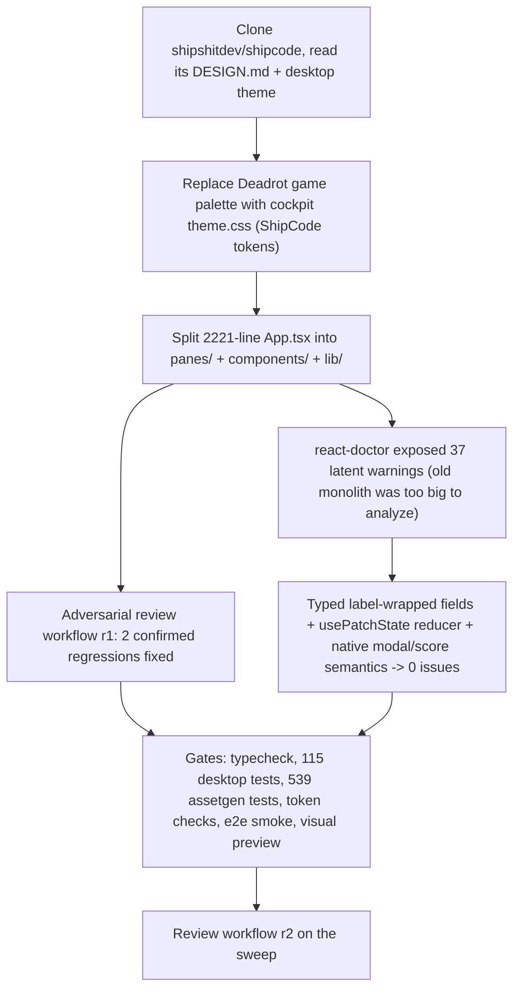

# 2026-07-10

## Session 1: desktop cockpit design refresh (ShipCode language) + renderer refactor

### System Flow

### Affected Components

- `apps/desktop/src/renderer`: new `theme.css` (ShipCode design language:
  layered near-black bgs, white accent CTAs, three-tier text, semantic status
  colors, 2/6/8/10 radii, DM Sans/SF Mono); `styles.css` rewritten on those
  tokens; `App.tsx` reduced to a shell with a pane registry; 13 panes in
  `panes/`; shared `components/` (typed field components, ModalBackdrop with a
  real click-away button, ModalHead, Sidebar with lucide icons) and `lib/`
  (usePatchState, useStreamLog, useProjectSelection, studio helpers, sections).
- `apps/desktop` deps: + `@fontsource/dm-sans`, + `lucide-react`.
- `packages/assetgen`: desktop removed from `DEFAULT_CONSUMER_FILES`
  (token-staleness) and `app-token-consumers.test.ts` now guards the new
  contract — the cockpit ships its own theme and must NOT fork game-brand
  tokens; game brand stays on web + games.

### Key Decisions

- The studio cockpit is deliberately NOT a consumer of the root DESIGN.md
  game-brand tokens; `apps/desktop/src/renderer/theme.css` is its canonical
  token source (modeled on shipshitdev/shipcode DESIGN.md).
- Old `tokens.css` deleted; staleness gate + consumer tests updated in the
  same change (no orphaned gate entries).
- react-doctor was green on master only because the 2221-line App.tsx exceeded
  its analysis limits; the split exposed 37 latent warnings which were fixed
  for real (label-wrapped field components, one reducer per pane's related
  state, fieldset for the score group, button-based modal click-away) — no
  suppressions.
- NumField clamps per keystroke ONLY where the old inline handlers did;
  the Opus bitrate keeps `clamp={false}` (old behavior let out-of-range
  values reach ffmpeg as typed).

### Mistakes / Gotchas

- Review-workflow round 1 caught two refactor regressions: the bitrate field
  had gained a per-keystroke clamp (breaks typing "64"), and World scale lost
  its `max=20` stepper cap. Both fixed.
- Playwright `getByText("SHIP SHIT")` matches the new "Ship Shit" brand text
  case-insensitively — e2e selectors (.studio, .project-card,
  .project-active-path, role/label queries) were kept stable on purpose.
- `pixelize-wiring.test.ts` greps renderer source paths; it now reads
  `panes/PixelizePanel.tsx` + `panes/SpritesPane.tsx`.
