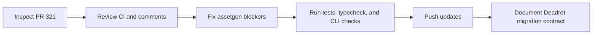

# Sessions: 2026-07-10

**Summary:** Completed and verified PR #321 assetgen QA hardening and downstream contract audit.

---

## Session 1: Complete assetgen QA PR

**Status:** Complete

### System Flow

### What was done

- [x] Loaded repo memory, rules, and session instructions.
- [x] Inspected PR metadata, all checks, reviews, review comments, and issue comments.
- [x] Audited the full assetgen diff and the six duplicated Deadrot scripts/helpers.
- [x] Made asset-qa CLI parsing fail closed for empty values, unknown arguments, and duplicate singleton flags.
- [x] Corrected the downstream contract for already-padded tier sheets and isolated-CI consumption.
- [x] Measured the committed Deadrot targets and pinned exact dimensions and luma ceilings.
- [x] Verified assetgen tests, typecheck, and CLI behavior.
- [x] Merged current `origin/master` into the PR branch without rewriting history.

### Files changed

- `packages/assetgen/src/commands/asset-qa.ts` - strict fail-closed command parsing.
- `packages/assetgen/src/asset-qa/manifest.ts` - rejects empty public API root overrides.
- `packages/assetgen/e2e/asset-qa.e2e.test.ts` - regression coverage for empty roots and unknown flags.
- `packages/assetgen/ASSET-QA.md` - exact Deadrot target values, tier-sheet state, and local-versus-CI contract.
- `.agents/SESSIONS/2026-07-10.md` - this session record.

### Key decisions

- Keep `packages/assetgen` in the studio repo and treat `../deadrotcom/packages/assets` as the downstream generated-output destination.
- Treat malformed repair CLI arguments as fatal because silently ignoring them can widen mutation scope.
- Migrate the already-final Deadrot tier sheets as check-only targets unless matching immutable unpadded sources are restored at distinct paths.
- Keep sibling-source commands local-only; an isolated Deadrot CI gate requires a released, version-pinned Ship Shit Games CLI surface.

### Mistakes and fixes

- The first local assetgen import exposed an incomplete optional `sharp` runtime install; `bun install --frozen-lockfile` restored the locked workspace without changing `bun.lock`.
- An initial `dwebp -info` probe used an unsupported option; dimensions were re-verified with `sips` and the assetgen decoder.

### Next steps

- [ ] Publish or proxy asset-qa through a versioned Ship Shit Games CLI before adding it to isolated Deadrot CI.
- [ ] In Deadrot, commit `packages/assets/asset-qa.json`, run both modes locally, then delete the three one-off fix scripts and duplicated helpers.

---

**Total sessions today:** 1
