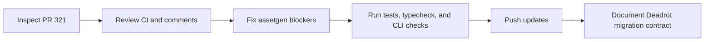
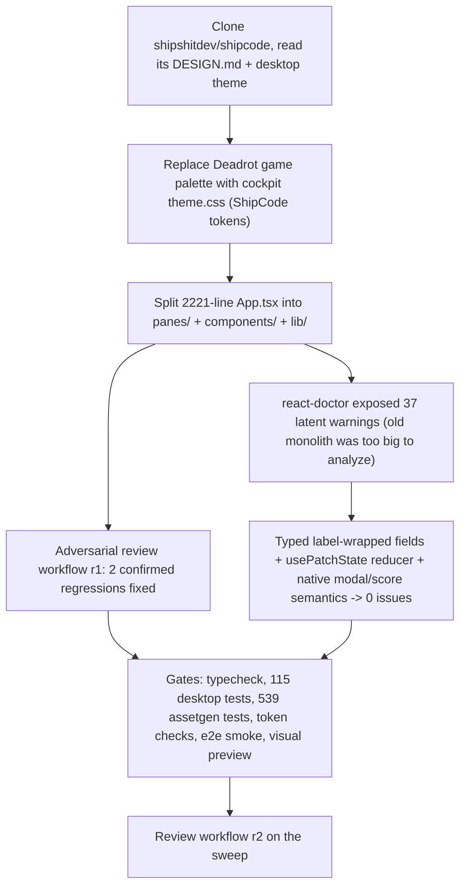

# Sessions: 2026-07-10

**Summary:** Completed PR #321 assetgen QA hardening and the desktop cockpit design refresh.

---

## Session 1: Complete assetgen QA PR

**Status:** Complete

### System Flow

### What was done

- [x] Loaded repo memory, rules, and session instructions.
- [x] Inspected PR metadata, all checks, reviews, review comments, and issue comments.
- [x] Audited the full assetgen diff and the six duplicated Deadrot scripts/helpers.
- [x] Made asset-qa CLI parsing fail closed for empty values, unknown arguments, and duplicate singleton flags.
- [x] Corrected the downstream contract for already-padded tier sheets and isolated-CI consumption.
- [x] Measured the committed Deadrot targets and pinned exact dimensions and luma ceilings.
- [x] Verified assetgen tests, typecheck, and CLI behavior.
- [x] Merged current `origin/master` into the PR branch without rewriting history.

### Files changed

- `packages/assetgen/src/commands/asset-qa.ts` - strict fail-closed command parsing.
- `packages/assetgen/src/asset-qa/manifest.ts` - rejects empty public API root overrides.
- `packages/assetgen/e2e/asset-qa.e2e.test.ts` - regression coverage for empty roots and unknown flags.
- `packages/assetgen/ASSET-QA.md` - exact Deadrot target values, tier-sheet state, and local-versus-CI contract.
- `.agents/SESSIONS/2026-07-10.md` - this session record.

### Key decisions

- Keep `packages/assetgen` in the studio repo and treat `../deadrotcom/packages/assets` as the downstream generated-output destination.
- Treat malformed repair CLI arguments as fatal because silently ignoring them can widen mutation scope.
- Migrate the already-final Deadrot tier sheets as check-only targets unless matching immutable unpadded sources are restored at distinct paths.
- Keep sibling-source commands local-only; an isolated Deadrot CI gate requires a released, version-pinned Ship Shit Games CLI surface.

### Mistakes and fixes

- The first local assetgen import exposed an incomplete optional `sharp` runtime install; `bun install --frozen-lockfile` restored the locked workspace without changing `bun.lock`.
- An initial `dwebp -info` probe used an unsupported option; dimensions were re-verified with `sips` and the assetgen decoder.

### Next steps

- [ ] Publish or proxy asset-qa through a versioned Ship Shit Games CLI before adding it to isolated Deadrot CI.
- [ ] In Deadrot, commit `packages/assets/asset-qa.json`, run both modes locally, then delete the three one-off fix scripts and duplicated helpers.

---

## Session 2: Desktop cockpit design refresh and renderer refactor

**Status:** Complete

### System Flow

### Affected Components

- `apps/desktop/src/renderer`: new `theme.css` (ShipCode design language:
  layered near-black bgs, white accent CTAs, three-tier text, semantic status
  colors, 2/6/8/10 radii, DM Sans/SF Mono); `styles.css` rewritten on those
  tokens; `App.tsx` reduced to a shell with a pane registry; 13 panes in
  `panes/`; shared `components/` (typed field components, ModalBackdrop with a
  real click-away button, ModalHead, Sidebar with lucide icons) and `lib/`
  (usePatchState, useStreamLog, useProjectSelection, studio helpers, sections).
- `apps/desktop` deps: + `@fontsource/dm-sans`, + `lucide-react`.
- `packages/assetgen`: desktop removed from `DEFAULT_CONSUMER_FILES`
  (token-staleness) and `app-token-consumers.test.ts` now guards the new
  contract — the cockpit ships its own theme and must NOT fork game-brand
  tokens; game brand stays on web + games.

### Key Decisions

- The studio cockpit is deliberately NOT a consumer of the root DESIGN.md
  game-brand tokens; `apps/desktop/src/renderer/theme.css` is its canonical
  token source (modeled on shipshitdev/shipcode DESIGN.md).
- Old `tokens.css` deleted; staleness gate + consumer tests updated in the
  same change (no orphaned gate entries).
- react-doctor was green on master only because the 2221-line App.tsx exceeded
  its analysis limits; the split exposed 37 latent warnings which were fixed
  for real (label-wrapped field components, one reducer per pane's related
  state, fieldset for the score group, button-based modal click-away) — no
  suppressions.
- NumField clamps per keystroke only where the old inline handlers did; the
  Opus bitrate keeps `clamp={false}` because the old behavior let out-of-range
  values reach ffmpeg as typed.

### Mistakes and fixes

- Review-workflow round 1 caught two refactor regressions: the bitrate field
  had gained a per-keystroke clamp (breaks typing "64"), and World scale lost
  its `max=20` stepper cap. Both were fixed.
- Playwright `getByText("SHIP SHIT")` matches the new "Ship Shit" brand text
  case-insensitively; e2e selectors (`.studio`, `.project-card`,
  `.project-active-path`, role/label queries) were kept stable.
- `pixelize-wiring.test.ts` greps renderer source paths; it now reads
  `panes/PixelizePanel.tsx` and `panes/SpritesPane.tsx`.

---

**Total sessions today:** 2
