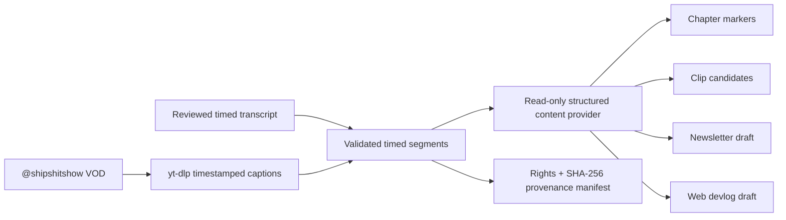

# Sessions: 2026-07-21

**Summary:** Implemented issue #295 as a timestamp-aware livestream-to-content pipeline for `@shipshitshow` VODs.

---

## Session 1: Repurpose livestream VODs into publication drafts

**Status:** Implementation complete; PR CI pending

### System flow

### What was done

- [x] Queried the exact `shipshit.games` Project and verified 45 exact Backlog items.
- [x] Selected and claimed issue #295 from milestone `2026-W35 · Weekly Release`, Priority P1.
- [x] Based `codex/295-stream-content-pipeline` directly on recorded `master` commit `79b5efac5fb5a7091afe2adf81c5d9e7e96a0937`.
- [x] Added the `shipshitshow` source manifest with the verified channel ID and raw-caption storage disabled.
- [x] Preserved JSON3 caption timestamps while retaining the existing flattened transcript API.
- [x] Added `vod-content` / `stream-content` CLI commands with network and reviewed offline inputs.
- [x] Generated deterministic chapters, bounded clip candidates, newsletter drafts, devlog drafts, and a rights/hash provenance manifest.
- [x] Ran the Codex provider in a read-only ephemeral directory with a strict output schema and prompt-injection boundary.
- [x] Added duplicate skip/overwrite/versioning behavior and a keyless mock provider.
- [x] Added focused parser, validation, persistence, duplicate, raw-transcript, and CLI coverage.

### Files changed

- `packages/ressources/src/stream-content.ts` and `stream-content.test.ts` - generation contract, provider boundary, output rendering, and focused coverage.
- `packages/ressources/src/transcript.ts` and `types.ts` - timestamped caption segments and stream-content types.
- `packages/ressources/src/cli.ts` and `index.ts` - public CLI and package exports.
- `packages/ressources/sources/shipshitshow/source.json` - canonical channel metadata and rights policy.
- `packages/ressources/README.md` - network/offline usage, output layout, provenance, and review policy.
- `.agents/SESSIONS/2026-07-21.md` - this session record.

### Key decisions

- Keep raw VOD captions out of the repository; persist only reviewed derivative drafts plus a transcript hash and rights status.
- Preserve real caption timestamps instead of estimating chapter and clip positions from flattened prose.
- Use one structured provider response and render all files in deterministic repository code.
- Keep generated content review-only; the command never publishes to Substack or the web app automatically.

### Verification

- `bun packages/ressources/src/cli.ts --help` - passed.
- `bun packages/ressources/src/cli.ts validate` - passed with 19 sources, 7 transcripts, and 1 derivative.
- Targeted Prettier check for new implementation, coverage, and source manifest - passed.
- `node scripts/check-secrets.mjs` - passed.
- `git diff --check` - passed.
- Local tests, typecheck, build, coverage, and E2E were skipped under workstation policy; PR CI owns executable verification.

### Mistakes and fixes

- The first PR CI run passed typecheck and 98 tests but exposed one brittle checked-in source-count assertion that still expected 18 sources. Updated it to 19 for the new canonical `shipshitshow` source.

### Next steps

- [ ] Observe exact-head PR CI and leave issue #295 `In Progress` for Fleet Review and merge workflow ownership.

---

**Total sessions today:** 1
