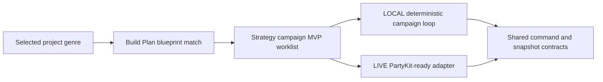

# 2026-07-21

## Session 1: Strategy campaign blueprint skill

**Duration:** ~1 hour
**Status:** Complete

### System Flow

### Affected Components

- `.agents/skills`: new reusable strategy-campaign game blueprint skill.
- `packages/assetgen`: focused checked-in blueprint discovery and genre-matching
  coverage.
- GitHub Project #4: issue #268 claimed from Backlog to In Progress.

### What Was Done

- Added `build-strategy-campaign-game` with a concise implementation workflow
  for Warline and other persistent strategy-front games.
- Defined the 3D portal lobby, five PBR texture sets, SVG region/lane/breach
  map, four-resource economy, Fortify/Muster/Deploy/Recon commands,
  deterministic local ticks, PartyKit-ready live seam, and accessible faction
  coding.
- Added a machine-readable `strategy-campaign` blueprint with required MVP and
  follow-up asset classes.
- Added OpenAI skill interface metadata.
- Added focused Build Plan coverage proving that the checked-in blueprint
  matches Warline's `Strategy Hub` catalog genre and broader strategy-campaign
  phrasing.
- Forward-tested the skill in an isolated agent context and clarified that the
  Build Plan command uses the selected game slug, with Warline as the canonical
  example.

### Key Decisions

- Local and live modes share one command/reducer/snapshot contract; PartyKit is
  a transport seam, not a second campaign implementation.
- Resource, faction, region, command-cost, and portal names remain
  project-defined so the reusable skill does not invent or copy canon.
- Campaign commands and operation results use stable idempotency keys, and
  offline catch-up is bounded to prevent duplicate or unbounded simulation.
- Toxic green remains reserved for Scourge infection and breach pressure;
  faction color always has a non-color counterpart.

### Files Changed

- `.agents/skills/build-strategy-campaign-game/SKILL.md`
- `.agents/skills/build-strategy-campaign-game/blueprint.json`
- `.agents/skills/build-strategy-campaign-game/agents/openai.yaml`
- `packages/assetgen/src/build-plan.test.ts`
- `.agents/SESSIONS/2026-07-21.md`

### Verification

- Skill Creator `quick_validate.py`: passed.
- Targeted Prettier formatting: passed.
- Blueprint JSON invariants and genre/MVP assertions: passed.
- `git diff --check`: passed.
- Working-tree secret scan: passed.
- Local unit tests, typecheck, build, coverage, and E2E were intentionally not
  run under workstation policy; PR CI owns those checks.

### Mistakes And Fixes

- The first final-claim shell probe used zsh's read-only `status` variable;
  renamed it to `item_status` and reran the full status/overlap check before
  mutating the project item.
- An unnecessary workspace-runtime lookup stalled; terminated it without repo
  changes and used the system Python directly for Skill Creator scripts.
- The first isolated forward test found a canonical-game-only command example;
  parameterized it with `<selected-game-slug>` while retaining Warline as the
  example.

### Next Steps

- Publish the ready-for-review PR against `master` and let GitHub Actions run
  the focused test plus broad repository checks.
- Leave issue #268 In Progress until the required Fleet Review exact-head gate
  handles merge readiness.
