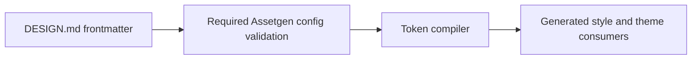

# Sessions: 2026-07-23

**Summary:** Implemented issue #192 and opened PR #384 to make `DESIGN.md` the only Assetgen generation-canon source.

---

## Session 1: Remove duplicated Assetgen token canon

**Status:** Complete

### System flow

### What was done

- [x] Queried the canonical `shipshit.games` Project through Projects v2 REST and counted 42 Backlog items.
- [x] Selected and claimed issue #192 from `2026-W36 · Weekly Release` at priority P2 after milestone-by-milestone eligibility and deduplication checks.
- [x] Removed the drifted in-code prompt, framing, provider, provenance, and grade fallback canon.
- [x] Added strict required-field validation for the authored Assetgen frontmatter and focused missing-canon coverage.
- [x] Preserved generated output byte-for-byte at the existing `73277f2a` hash.
- [x] Opened ready PR #384 against `master`.

### Files changed

- `DESIGN.md` - preserves the canonical kind-map output order.
- `packages/assetgen/src/tokens.ts` - removes duplicated canon and validates the authored source.
- `packages/assetgen/src/tokens.test.ts` - uses explicit test canon and covers a missing Assetgen block.
- `.agents/SESSIONS/2026-07-23.md` - this session record.

### Key decisions

- Fail fast when the canonical Assetgen block is missing instead of relocating or retaining undocumented fallback prose.
- Keep `pixelArt.palette` as the source for the generated palette line; all other generation canon is authored under `assetgen`.
- Leave issue #192 `In Progress` for Fleet Review and merge workflow ownership.

### Verification

- Assetgen design lint, token drift, secret scan, and diff integrity passed locally.
- Local tests, typecheck, build, coverage, and E2E were skipped under workstation policy and delegated to PR CI.

### Next steps

- [ ] Fleet Review the exact PR head and merge PR #384 when approved.

---

**Total sessions today:** 1
