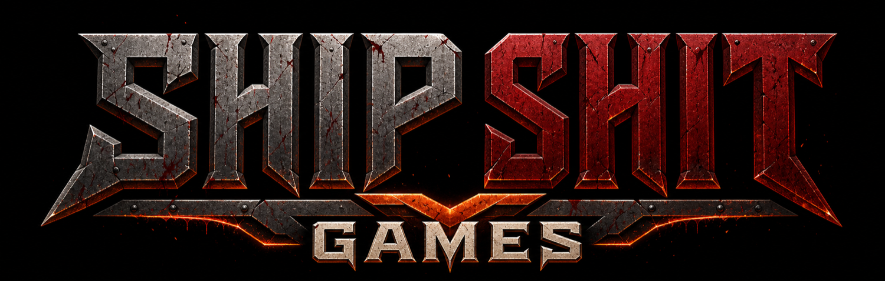

# Ship Shit Games



**The studio monorepo for building games with AI in public.**

[shipshit.games](https://shipshit.games) |
[deadrot.com](https://deadrot.com)

## Current Stage

This repo is the studio side of Ship Shit Games: the public site, docs, CLI,
desktop studio, asset-generation tooling, research library, and shared packages
used to build and explain the DEADROT pipeline.

The player-facing DEADROT hub, lore app, games, runtime assets, and shipped game
packages now live in
[`shipshitgames/deadrotcom`](https://github.com/shipshitgames/deadrotcom).

## Apps

- `apps/web` - live Next 16 studio site for Skills Pro, DEADROT proof, the asset
  pipeline, pricing, and public calls to action.
- `apps/docs` - Nextra docs for studio tools, asset generation, research,
  Warline, shared packages, canon rules, and deployment notes.
- `apps/cli` - `shipshitgames` / `ssg` command-line entrypoint.
- `apps/desktop` - Electron + Vite + React studio cockpit for maps, sprites, 3D,
  music/SFX, local Codex CLI flows, and provider integrations.
- `apps/warline` - Vite/React War for the Lanes strategy hub over the shared
  `@shipshitgames/warline` model and optional PartyKit Durable Object.

## Packages

- `packages/assetgen` / `@shipshitgames/assetgen` - reusable asset-generation
  core and CLI. Reads/writes `../deadrotcom/packages/assets` by default.
- `packages/engine` / `@shipshitgames/engine` - open-source embodied Three.js
  game engine primitives shared by studio titles.
- `packages/ressources` / `@shipshitgames/ressources` - research/transcript
  library, distillation CLI, and derivative skill/app/tool candidates.
- `packages/shared` / `@shipshitgames/shared` - shared TypeScript utilities and
  types.
- `packages/ui` / `@shipshitgames/ui` - shared React UI primitives, Tailwind
  styles, and game-flavored component shells.
- `packages/warline` / `@shipshitgames/warline` - pure world-state model,
  reducers, game operation contract, and client SDK for Warline.

## Repo Map

```txt
apps/
  web/       # shipshit.games
  docs/      # docs.shipshit.games
  cli/       # shipshitgames / ssg binary
  desktop/   # Electron studio
  warline/   # persistent strategy hub
packages/
  assetgen/
  engine/
  ressources/
  shared/
  ui/
  warline/
scripts/
```

## Develop

```bash
bun install
bun run dev
bun run build
bun run typecheck
```

Common focused commands:

```bash
bun --filter web dev
bun --filter docs dev
bun --filter @shipshitgames/desktop dev
bun --filter warline dev:all
bun --filter @shipshitgames/warline test
```

## Operating Notes

- Default branch: `master`.
- Runtime DEADROT games ship from `../deadrotcom/apps/games/<slug>`.
- Generated game assets belong in `../deadrotcom/packages/assets`.
- Studio learning material and distilled rules belong in `packages/ressources`.
- Release automation starts at `bun run release`; use `bun run release:run` to
  execute the planned release.

## Related Repos

- [`shipshitgames/deadrotcom`](https://github.com/shipshitgames/deadrotcom) -
  DEADROT hub, lore, games, assets, and runtime packages.
- [`shipshitgames/skills`](https://github.com/shipshitgames/skills) - agent
  skills used by the studio.
- [`shipshitdev/v0`](https://github.com/shipshitdev/v0) - product scaffolder
  used for new Bun/Turbo/Next workspaces.
